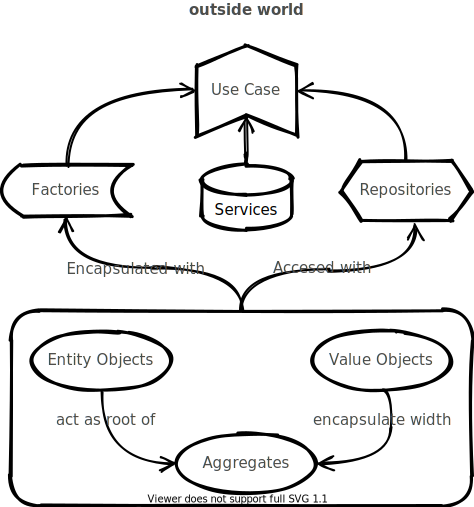

Domain Driven Design strategies for the Frontend Architecture
-------------------------------------------------------------

This repo contains an example of design strategies to build a clean frontend architecture. It uses a tweet clone as an example.



# The building blocks

## Use Case
The verb of the architecture. To be used only to communicate with the exterior world.


## Service
The verb of the architecture. to be used only inside the domain.

## Entity Objects
Are objects that has an entity. This objects are mutable.

## Value Objects
Are objects that identify by his value. This objects should be inmutable.

## Agregates
Are a group of objects considered as a unit regard to data changes.

## Factories
Are used to encapsulate the knowledge neccesary for the object creation.

## Repositories
Are used to encapsulate all the logic needed to obtain object references. Acts as a storage place for globally accesible objects. Can contain links to the infraestructure eg. the database.

## Modules
Are a way to split the domain in managable parts.

# Folder structure

```
├── domain
│   ├── index
│   ├── common (context)
│   │   ├── Entity
│   │   ├── Service
│   │   ├── UseCase
│   │   └── ValueObject
│   ├── trino (context)
│   │   └── UseCases
│   │       └── CreateTrinoUseCase
│   └── user (context)
│       ├── Entities
│       │   ├── UserEntity
│       │   └── factories
│       ├── Repositories
│       │   ├── InMemoryUserRepository
│       │   ├── LocalStorageUserRepository
│       │   ├── UserRepository
│       │   └── factories
│       ├── Services
│       │   ├── CurrentUserService
│       │   └── factory
│       ├── UseCases
│       │   ├── CurrentUserUseCase
│       │   ├── LoginUserUseCase
│       │   ├── LogoutUserUseCase
│       │   ├── RegisterUserUseCase
│       │   └── factories
│       └── ValueObjects
│           ├── PasswordValueObject
│           ├── StatusValueObject
│           ├── UserNameValueObject
│           └── factories
```
